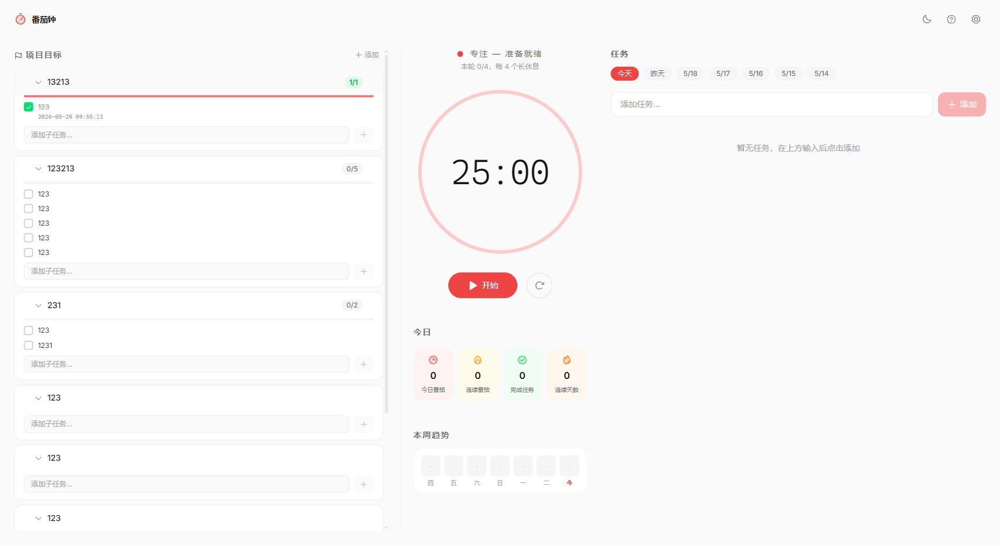

<div align="center">
  
  <h1>FlowFit</h1>
  <p><strong>A healthy pomodoro desktop app for productive workers</strong></p>
  <p>
    <a href="#features">Features</a> •
    <a href="#screenshots">Screenshots</a> •
    <a href="#tech-stack">Tech Stack</a> •
    <a href="#getting-started">Getting Started</a> •
    <a href="#project-structure">Structure</a> •
    <a href="./README.zh-CN.md">中文</a>
  </p>
  <p>
    
    
    
  </p>
</div>

---

## Overview

FlowFit is a **desktop pomodoro timer** built with Tauri v2, React, and TypeScript. It goes beyond a simple timer — integrating task management, pelvic floor (Kegel) exercise reminders, milestone planning, AI-powered daily/weekly reports, and health break suggestions. Designed for knowledge workers who care about both productivity and physical well-being.

> 🚧 **Status**: Active development. The macOS DMG build is coming soon via GitHub Actions.

## Features

### 🍅 Core Pomodoro
- **Focus / Break / Long Break** phases with configurable durations
- **Circular SVG progress** animation with real-time visual feedback
- **Active task label** displayed inside the timer ring
- **Auto-start** mode for seamless focus-flow cycles
- **Sound notifications** via Web Audio API (no external audio files needed)
- **Desktop notifications** via system native notifications

### ✅ Task Management
- Add / delete tasks, track pomodoro count per task
- **Activate a task** — pomodoros completed during activation count toward it
- Mark tasks complete with visual check
- Automatic daily stats aggregation

### 🏋️ Pelvic Floor (Kegel) Exercise
- **Guided Kegel sessions** after each focus session — contract / relax rhythm
- Popup window in the bottom-right corner of the screen (decorated, always-on-top)
- Configurable reps and hold duration
- Educational health tips carousel during the exercise
- Works seamlessly with the break timer — start your break after completing

### 🎯 Milestone Planning
- Create **project milestones** with sub-task breakdowns
- Drag-and-drop reorder milestones and tasks
- Collapse / expand milestone groups
- Each sub-task records its completion timestamp
- One-click add sub-task to the active pomodoro queue

### 📊 Daily & Weekly Reports
- **AI-powered report generation** using DeepSeek API
- Daily: auto-generated work summary from today's data
- Weekly: comprehensive weekly review with trend analysis
- Markdown formatted, export-friendly content
- Fallback to rule-based summary when API key is not configured

### 🧘 Rest Activity Preferences
- Choose your preferred rest activity: **Stretch** / **Breathing** / **Pelvic Floor**
- Guided prompts after each focus session
- Preference dialog for first-time users
- Helps build a healthy work-rest rhythm

### 🎨 Theme & UI
- **Light / Dark / System** theme modes
- Responsive layout (compact single-column on narrow screens)
- Phosphor icons throughout
- Tailwind CSS v4 styling
- System tray with show/hide and quit actions
- Minimize to tray on close (Windows)

### 💾 Data Persistence
- `localStorage` for browser fallback
- **Local file storage** via Tauri FS plugin for desktop (survives reinstallation)
- All data survives app restart and reinstall when configured

## Screenshots

| Main Timer | Settings | Kegel Popup |
|:---:|:---:|:---:|
|  |  |  |

> *Screenshots will be updated as the UI evolves.*

## Tech Stack

| Layer | Technology |
|-------|-----------|
| **Desktop Shell** | Tauri v2 (Rust) |
| **Frontend** | React 19 + TypeScript 6 (strict) |
| **Build** | Vite 8 |
| **State** | Zustand |
| **Style** | Tailwind CSS v4 |
| **Icons** | Phosphor Icons |
| **Audio** | Web Audio API |
| **Reports** | DeepSeek API |
| **Desktop** | Tauri FS, Dialog, Opener plugins |

## Getting Started

### Prerequisites

- **Node.js** >= 18
- **Rust** >= 1.77 (for Tauri desktop build)
- **Windows**: MSVC build tools (via Visual Studio Build Tools or `visualstudio` Cargo feature)
- **macOS**: Xcode Command Line Tools (`xcode-select --install`)

### Install & Run

```bash
# Clone the repository
git clone https://github.com/YOUR_USERNAME/flowfit.git
cd flowfit

# Install frontend dependencies
npm install

# Run in development mode (hot-reload)
npm run tauri:dev

# Build production desktop app
npm run tauri:build
```

### Development Server Only (Browser)

```bash
npm run dev
# Open http://localhost:5173 in your browser
# Note: File persistence and Kegel popup require Tauri desktop runtime
```

## Project Structure

```
flowfit/
├── src/                          # Frontend source
│   ├── main.tsx                  # Entry point (app + sub-window routing)
│   ├── App.tsx                   # Main app layout
│   ├── index.css                 # Tailwind + global styles
│   ├── types/index.ts            # TypeScript type definitions
│   ├── constants/index.ts        # Defaults, color config
│   ├── components/
│   │   ├── TimerDisplay.tsx       # Main timer UI with circular progress
│   │   ├── TimerControls.tsx      # Start / Pause / Reset buttons
│   │   ├── CircularProgress.tsx   # SVG progress ring component
│   │   ├── Header.tsx             # Top bar with settings and theme
│   │   ├── StatsPanel.tsx         # Today's pomodoro statistics
│   │   ├── WeekChart.tsx          # Weekly trend chart
│   │   ├── TaskList.tsx           # Task management list
│   │   ├── MilestonePanel.tsx     # Milestone planning board
│   │   ├── KegelGuide.tsx         # Kegel exercise guidance UI
│   │   ├── KegelPopup.tsx         # Sub-window for Kegel popup
│   │   ├── RestActivityGuide.tsx  # Rest activity prompt
│   │   ├── RestPreferenceDialog.tsx # First-time preference selector
│   │   ├── ReportPanel.tsx        # Daily / Weekly report display
│   │   ├── WeeklyReportModal.tsx  # Weekly report modal
│   │   ├── NewsModal.tsx          # AI-edited news modal
│   │   └── NewsTickerBar.tsx      # News ticker bar
│   ├── hooks/
│   │   ├── useTimer.ts            # Core timer scheduling logic
│   │   ├── useKegel.ts            # Kegel exercise state machine
│   │   └── useTheme.ts            # Theme switching
│   ├── store/
│   │   ├── timerStore.ts          # Timer and settings state
│   │   ├── taskStore.ts           # Tasks and daily stats
│   │   ├── milestoneStore.ts      # Milestones state
│   │   └── reportStore.ts         # Reports state
│   ├── utils/
│   │   ├── storage.ts             # localStorage persistence
│   │   ├── fileStorage.ts         # Tauri FS file persistence
│   │   ├── audio.ts               # Web Audio API sound generation
│   │   ├── aiNews.ts              # AI news integration
│   │   ├── deepseek.ts            # DeepSeek API client
│   │   ├── reportPrompts.ts       # Report generation prompts
│   │   └── restActivities.ts      # Rest activity helpers
│   └── assets/
│       └── hero.png
├── src-tauri/                     # Tauri Rust backend
│   ├── src/
│   │   ├── main.rs                # Desktop entry point
│   │   └── lib.rs                 # Tauri setup, tray, Kegel popup commands
│   ├── icons/                     # App icons (all platforms)
│   ├── tauri.conf.json            # Tauri configuration
│   └── Cargo.toml                 # Rust dependencies
├── public/
│   ├── favicon.svg                # Favicon
│   └── icons.svg                  # Icons sprite
├── docs/                          # Design documents and plans
│   └── superpowers/
├── .github/workflows/
│   └── build-mac.yml              # macOS DMG build workflow
├── package.json
├── vite.config.ts
├── tsconfig.json
└── eslint.config.js
```

## Building for macOS

This project includes a [GitHub Actions workflow](.github/workflows/build-mac.yml) for automated macOS builds:

1. Push to GitHub
2. Go to **Actions** → **Build Mac DMG** → **Run workflow**
3. Download the built `.dmg` artifact

Or build manually on a Mac:

```bash
npm run tauri:build -- --bundles dmg
```

## Contributing

Please read [CONTRIBUTING.md](./CONTRIBUTING.md) for details on our code of conduct and the process for submitting pull requests.

## Code of Conduct

All contributors are expected to adhere to the [Code of Conduct](./CODE_OF_CONDUCT.md).

## Changelog

See [CHANGELOG.md](./CHANGELOG.md) for version history.

## License

This project is licensed under the MIT License — see the [LICENSE](./LICENSE) file for details.

## Acknowledgments

- Inspired by the Pomodoro Technique® by Francesco Cirillo
- Built with [Tauri](https://tauri.app/), [React](https://react.dev/), and [TypeScript](https://www.typescriptlang.org/)
- Icons by [Phosphor Icons](https://phosphoricons.com/)
